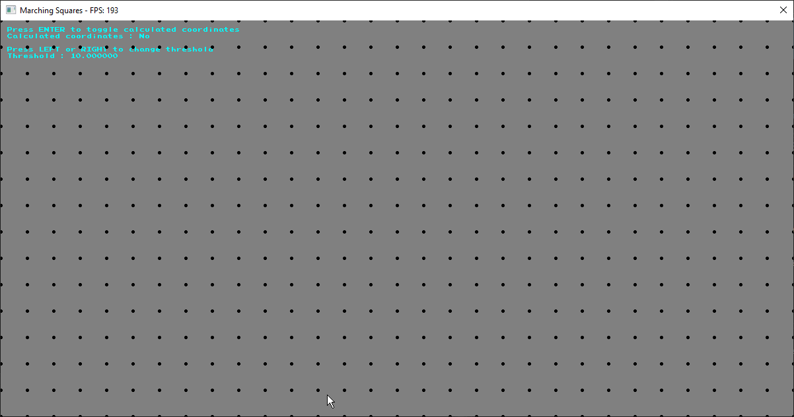

# Marching Squares

## Description

Ce projet est une implémentation simple de l'algorithme Marching Squares en C++ utilisant la librairie olcConsoleGameEngine.

## Commandes (clavier)

- `<-` : Diminuer la valeur de seuil
- `->` : Augmenter la valeur de seuil
- `R` : Générer une nouvelle carte
- `Enter` : Utiliser les coordonnées calculées

